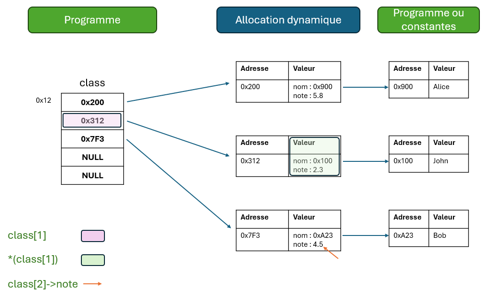

# Exercices sur l'allocation dynamique en C

1. Représenter graphiquement les zones mémoires du code suivant (zone programme, zone fonction, zone allocation...): 
```c
typedef struct {
    int id;
    double value;
} Measure;

int main(void){
    Measure* data = malloc(10 * sizeof(Measure));
}
```

2. Représenter en graphiquement les zones mémoires du code suivant : 
```c
typedef struct {
    int id;
    double value;
} Measure;

typedef struct {
    Measure* datas;
    int capacity;
} Array;

int main(void){
    Array ar;
    ar.datas = malloc(10 * sizeof(Measure));
}
```

3. Représenter en graphiquement les zones mémoires du code suivant : 
```c
typedef struct {
    int id;
    double value;
} Measure;

typedef struct {
    Measure* datas;
    int capacity;
    char* name;
} Container;

Container* create(int capacity, char* name){
    Container* ar = malloc(sizeof(Container));
    ar->datas = malloc(capacity * sizeof(Measure));
    ar->name = name;
    return ar;
}

int main(void){
    Container* tab = create(10, "Meas1");
}
```

4.
- Qu'est ce qui est stocké dans la variable `ar->name` dans la structure `Container` de l'exercice 3 ?
- Que fais l'instruction `ar->name = name;` de l'exercice 3 ?
- Ecrire une instruction dans le main de l'exercice 3 qui permet de récupèrer la valeur de la 3ème mesures.
- Est-ce que la taille de la structure `Container` de l'exercice 3 dépend du nombre de mesure ?

5. Écrivez une fonction `int* creer_tableau(int taille)` qui alloue dynamiquement un tableau de valeurs entières, l'initialise à 0, et retourne un pointeur vers ce tableau.

6. Écrivez une fonction `char* copier_majuscule(const char* chaine)` qui retourne une copie de la chaîne passée en paramètre, convertie en majuscules. Utilisez l'allocation dynamique.

7. Implémentez une fonction `void liberer_memoire(int* tableau)` qui libère un tableau d'entiers alloué dynamiquement.

8. Écrivez une fonction `char* decouper_mot(const char* phrase)` qui retourne le premier mot d'une phrase (mots séparés par des espaces) ou NULL si pas de mot.

9. Implémentez une fonction `void insert_element(int* tableau, int* count, int element)` qui ajoute dynamiquement un élément au début d’un tableau d’entiers (`count`: le nombre d'éléments). On sait qu'il reste de la place dans le tableau.

10. Implémentez une fonction `char* concatener(const char* s1, const char* s2)` qui retourne une nouvelle chaîne, résultat de la concaténation de deux chaînes données, allouée dynamiquement.

11. Créez une structure `Point` contenant deux coordonnées entières `x` et `y`, puis écrivez une fonction `Point* creer_point(int x, inty)` qui retourne un pointeur vers nouveau point.

12. Créez une structure `Etudiant` contenant un nom (chaîne dynamique) et une note (float), puis écrivez une fonction `Etudiant* creer_etudiant(const char* nom, float note)` qui retourne un pointeur vers un nouvel étudiant.

13. Le programme `main` suivant est créé en fonction de l'exerice précédant.
```c
int main(){
    Etudiant* class[] = {NULL, NULL, NULL, NULL, NULL};

    class[0] = creer_edutiant("Alice", 5.8);
    class[1] = creer_edutiant("John", 2.3);
    class[2] = creer_edutiant("Bob", 4.5);
}
```

- Est-ce que le code parraît correct ?
- Est-ce qu'il est correct de stocker des pointeurs ou il faudrait un tableau d'étuidant à la place ?
- Représenter graphiquement la mémoire de ce programme.
- Que se passe-t-il avec l'instruction `class[3]->nom


# Solutions
4.
- L'adresse de la chaîne de caractères "Meas1" est stockée dans `ar->name`.
- L'instruction copie l'adresse de la chaîne de caractères "Meas1" dans `ar->name`, donc `ar->name` pointe vers la même adresse mémoire que `name`.
- `printf("Mesure 3: %d\n", tab->datas[2].value);`
- Non

1. Écrivez une fonction `int* creer_tableau(int taille)` qui alloue dynamiquement un tableau de valeurs entières, l'initialise à 0, et retourne un pointeur vers ce tableau.
```c
int* creer_tableau(int taille){
    int* tableau = malloc(taille * sizeof(int));
    if (tableau == NULL) {
        return NULL;
    }

    for (int i = 0; i < taille; i++) {
        tableau[i] = 0;
    }
    return tableau;
}
```

2. Écrivez une fonction `char* copier_majuscule(const char* chaine)` qui retourne une copie de la chaîne passée en paramètre, convertie en majuscules. Utilisez l'allocation dynamique.
```c
char* copier_majuscule(const char* chaine) {
    int taille = strlen(chaine);
    char* copie = malloc((taille + 1) * sizeof(char));
    if (copie == NULL) {
        return NULL;
    }

    for (int i = 0; i < taille; i++) {
        copie[i] = toupper(chaine[i]);
    }
    copie[taille] = '\0'; // N'oubliez pas de terminer la chaîne par un caractère nul
    return copie;
}
```

3. Implémentez une fonction `void liberer_memoire(int* tableau)` qui libère un tableau d'entiers alloué dynamiquement.
```c
void liberer_memoire(int* tableau) {
    free(tableau);
}
```

4. Écrivez une fonction `char* decouper_mot(const char* phrase)` qui retourne le premier mot d'une phrase (mots séparés par des espaces) ou NULL si pas de mot.
```c
char* decouper_mot(const char* phrase) {
    if (phrase == NULL || *phrase == '\0') return NULL;

    const char* end = phrase;

    while (*end != '\0' && *end != ' ') {
        end++;
    }

    size_t len = end - phrase;
    if (len == 0) return NULL;

    char* mot = (char*)malloc(len + 1);
    if (!mot) return NULL;

    strncpy(mot, phrase, len);
    mot[len] = '\0';

    return mot;
}
```

5. Implémentez une fonction `void insert_element(int* tableau, int* count, int element)` qui ajoute dynamiquement un élément au début d’un tableau d’entiers (`count`: le nombre d'éléments). On sait qu'il reste de la place dans le tableau.
```c
void insert_element(int* tableau, int* count, int element) {
    for (int i = *count; i > 0; i--) {
        tableau[i] = tableau[i - 1];
    }
    tableau[0] = element;
    (*count)++;
}
```

6.  Implémentez une fonction `char* concatener(const char* s1, const char* s2)` qui retourne une nouvelle chaîne, résultat de la concaténation de deux chaînes données, allouée dynamiquement.
```c
char* concatener(const char* s1, const char* s2) {
    if (s1 == NULL && s2 == NULL) return NULL;

    size_t len1 = s1 ? strlen(s1) : 0;
    size_t len2 = s2 ? strlen(s2) : 0;

    char* resultat = malloc(len1 + len2 + 1);
    if (resultat == NULL) {
        return NULL;
    }

    if (s1 != NULL) {
        strcpy(resultat, s1);
    }
    if (s2 != NULL) {
        strcpy(resultat + len1, s2);
    }
    return resultat;
}
```

7.  Créez une structure `Point` contenant deux coordonnées entières `x` et `y`, puis écrivez une fonction `Point* creer_point(int x, inty)` qui retourne un pointeur vers nouveau point.
```c
typedef struct {
    int x;
    int y;
} Point;

Point* creer_point(int x, int y) {
    Point* p = malloc(sizeof(Point));
    if (p == NULL) {
        return NULL;
    }
    p->x = x;
    p->y = y;
    return p;
}
```

8.  Créez une structure `Etudiant` contenant un nom (chaîne dynamique) et une note (float), puis écrivez une fonction `Etudiant* creer_etudiant(const char* nom, float note)` qui retourne un pointeur vers un nouvel étudiant.
```c
typedef struct {
    char* nom;
    double note;
} Etudiant;

Etudiant* creer_etudiant(char* nom, double note) {
    Etudiant* etu = malloc(sizeof(Etudiant));
    if (etu == NULL) {
        return NULL;
    }
    etu->nom = nom;
    etu->note = note;
    return etu;
}
```


9.  Le programme `main` suivant est créé en fonction de l'exerice précédant.
```c
int main(){
    Etudiant* class[] = {NULL, NULL, NULL, NULL, NULL};

    class[0] = creer_edutiant("Alice", 5.8);
    class[1] = creer_edutiant("John", 2.3);
    class[2] = creer_edutiant("Bob", 4.5);
}
```

- Est-ce que le code parraît correct ? Oui
- Est-ce qu'il est correct de stocker des pointeurs ou il faudrait un tableau d'étuidant à la place ? Oui; il est correct de stocker des pointeurs.
- Représenter graphiquement la mémoire de ce programme.



- Que se passe-t-il avec l'instruction `class[3]->nom : `class[3]` est NULL, donc il y a une erreur de segmentation.